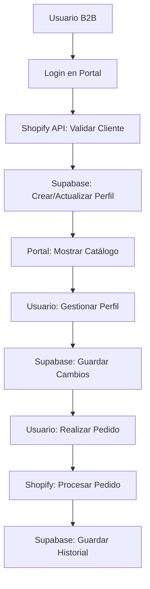

# 🗄️ Opciones de Base de Datos para tu Portal B2B

## ❓ Pregunta Original: "¿Dónde se guardan los datos? ¿Vercel actúa como base de datos?"

**Respuesta corta:** ❌ **Vercel NO es una base de datos**. Vercel es solo una plataforma de hosting/deployment.

## 📊 Estado Actual de tu Portal

### Antes (Sin Perfiles):
```
📁 Datos de Productos: b2b-products.json (archivo local)
👤 Datos de Clientes: API de Shopify (solo lectura)
🛒 Carrito: localStorage del navegador
🔐 Sesiones: Memoria del servidor (se pierden al reiniciar)
```

### Ahora (Con Perfiles):
```
📁 Productos: b2b-products.json + Supabase (opcional)
👤 Perfiles: Supabase PostgreSQL ✅
📍 Direcciones: Supabase PostgreSQL ✅
📦 Historial: Supabase PostgreSQL ✅
🛒 Carrito: localStorage + Supabase (futuro)
🔐 Sesiones: Memoria + Supabase perfiles
```

## 🚀 Mejores Opciones de Base de Datos (2024)

### 1. **Supabase** ⭐ (Recomendado - Ya implementado)
```yaml
Tipo: PostgreSQL + BaaS
Precio: GRATIS hasta 500MB
Límites Gratis:
  - 500MB de storage
  - 2GB de transfer mensual
  - 50k autenticaciones/mes
  - 500k requests/mes

Ventajas:
  ✅ PostgreSQL completo
  ✅ API REST automática
  ✅ Realtime subscriptions
  ✅ Dashboard visual
  ✅ Perfecto para perfiles de usuario

Pricing:
  - Free: $0 (ideal para testing/MVP)
  - Pro: $25/mes (2-8GB)
  - Team: $599/mes (8GB+)
```

### 2. **PlanetScale**
```yaml
Tipo: MySQL Serverless
Precio: GRATIS hasta 5GB
Límites Gratis:
  - 5GB de storage
  - 1 billion reads/mes
  - 10 million writes/mes

Ventajas:
  ✅ Muy rápido (edge locations)
  ✅ Scaling automático
  ✅ Branching como Git
  ❌ MySQL (menos features que PostgreSQL)
```

### 3. **Vercel Postgres** 
```yaml
Tipo: PostgreSQL (Powered by Neon)
Precio: Desde $20/mes
Límites:
  - Hobby: 60k requests/mes
  - Pro: 5GB storage

Ventajas:
  ✅ Integración perfecta con Vercel
  ✅ PostgreSQL completo
  ❌ No tiene plan gratuito
  ❌ Más caro que Supabase
```

### 4. **MongoDB Atlas**
```yaml
Tipo: NoSQL Document Database
Precio: GRATIS hasta 512MB
Límites Gratis:
  - 512MB de storage
  - Shared clusters

Ventajas:
  ✅ NoSQL flexible
  ✅ Buen para datos no relacionales
  ❌ Menos adecuado para perfiles estructurados
```

### 5. **Firebase**
```yaml
Tipo: NoSQL Realtime Database
Precio: GRATIS con límites
Límites Gratis:
  - 1GB de storage
  - 50k simultaneous connections

Ventajas:
  ✅ Realtime por defecto
  ✅ Integración con Google
  ❌ NoSQL learning curve
  ❌ Costos pueden escalar rápido
```

## 🎯 Recomendación para tu Portal B2B

### **Usar Supabase** es la mejor opción porque:

1. **💰 Económico**: Plan gratuito generoso
2. **🔧 Fácil Setup**: Ya está implementado en tu código
3. **📈 Escalable**: PostgreSQL robusto
4. **🎨 UI Amigable**: Dashboard visual para ver datos
5. **🔐 Seguro**: Row Level Security (RLS)
6. **⚡ Rápido**: APIs optimizadas

## 🛠️ ¿Cómo implementar? (Ya está listo!)

### Paso 1: Crear cuenta en Supabase
```bash
1. Ir a https://supabase.com
2. Sign up gratis
3. Crear nuevo proyecto
4. Copiar URL y API keys
```

### Paso 2: Configurar variables de entorno
```env
SUPABASE_URL=https://tu-proyecto.supabase.co
SUPABASE_ANON_KEY=tu_anon_key
SUPABASE_SERVICE_KEY=tu_service_key
```

### Paso 3: Inicializar base de datos
```bash
npm run setup-db
```

¡Y listo! Tu portal ya tiene:
- ✅ Perfiles de usuario persistentes
- ✅ Direcciones de envío/facturación
- ✅ Historial de pedidos
- ✅ Estadísticas de compras

## 🔄 Flujo de Datos Completo



## 💡 Alternativas Futuras

### Si creces mucho (1000+ usuarios):
1. **Migrar a PostgreSQL dedicado** (DigitalOcean, AWS RDS)
2. **Usar Redis** para caché
3. **Implementar CDN** para imágenes

### Si necesitas más features:
1. **Analytics avanzados**: Mixpanel, Amplitude
2. **Search**: Algolia, Elasticsearch  
3. **Files**: AWS S3, Cloudinary

## 🎉 Resumen

- ❌ **Vercel**: Solo hosting, NO base de datos
- ✅ **Supabase**: Base de datos principal (recomendado)
- 📁 **Archivos locales**: Solo para productos sincronizados
- 🛒 **localStorage**: Solo para carrito temporal

**Tu portal B2B ahora es completamente funcional con persistencia real de datos!** 🚀 